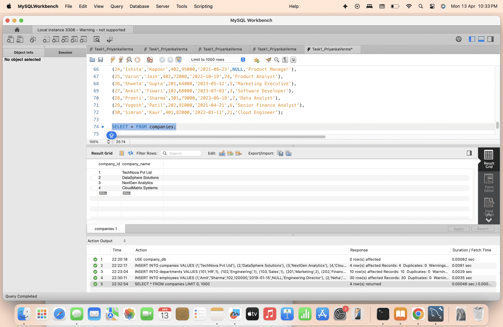
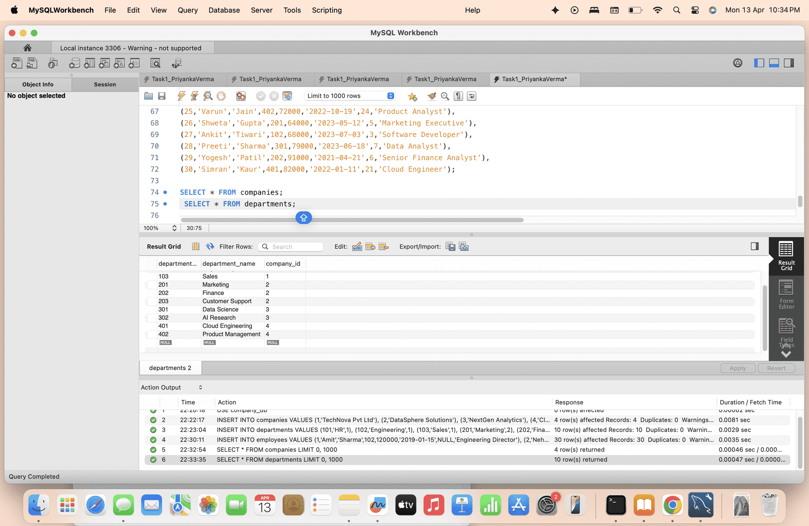
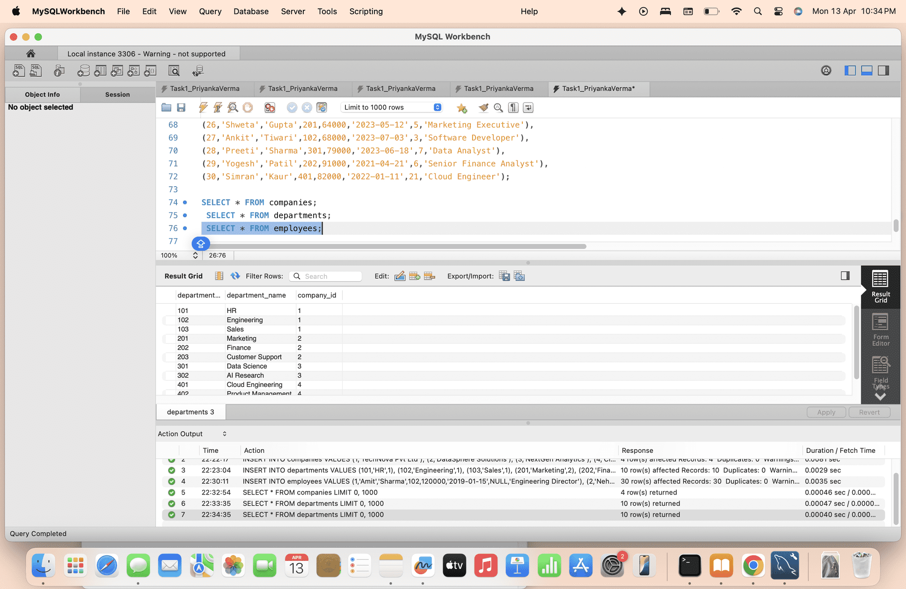

# Company Database SQL Project

## 📌 Overview
This project demonstrates SQL skills including:
- Database creation
- Table relationships using FOREIGN KEY
- Data insertion and querying

## 🗂 Tables Created
- companies
- departments
- employees

## 🔗 Key Concepts Used
- PRIMARY KEY
- FOREIGN KEY
- NOT NULL
- Data relationships

## 📸 Screenshots

### Companies Table

### Departments Table

### Employees Table

## 👩‍💻 Author
Priyanka Verma
